# DevOps Project 4: MEAN Stack Application Deployment on AWS EC2

## Project Overview

This project documents my hands-on deployment of a **MEAN Stack application on an Ubuntu AWS EC2 instance**.

The MEAN Stack consists of:

- **MongoDB** for data storage
- **Express.js** for backend routing and application logic
- **Angular** for the frontend
- **Node.js** as the JavaScript runtime

My goal in this project was not simply to get the application running. I wanted to understand how the different layers of a real application deployment work together, from cloud infrastructure and Linux administration to application dependencies, database services, routing, networking and final browser accessibility.

This project became an important part of my DevOps learning journey because it helped me understand what happens underneath an application deployment before I progressed into more advanced topics such as automation, configuration management and multi-server infrastructure.

---

## Recruiter Snapshot

In this project, I:

- Provisioned an Ubuntu EC2 instance in AWS
- Connected securely to the server through SSH
- Installed and verified Node.js
- Installed and verified npm
- Configured and verified MongoDB
- Worked with the application's `server.js` file
- Configured the MEAN Stack application
- Troubleshot application routing issues
- Corrected a `routes.js` syntax problem
- Started the Node.js server on port `3300`
- Configured AWS Security Groups
- Allowed application traffic through port `3300`
- Validated the deployed application successfully in a browser

This project gave me practical experience troubleshooting deployment issues across several layers instead of assuming every problem was caused by AWS or Linux.

---

## Project Architecture

```text
                         Internet
                            |
                            |
                    AWS Security Group
                            |
                      TCP Port 3300
                            |
                            v
                   +----------------+
                   |    AWS EC2     |
                   |    Ubuntu      |
                   |                |
                   |    Angular     |
                   |       |        |
                   |       v        |
                   |   Express.js   |
                   |       |        |
                   |       v        |
                   |    Node.js     |
                   |       |        |
                   |       v        |
                   |    MongoDB     |
                   +----------------+
```

The complete application is hosted on an Ubuntu EC2 instance, while AWS Security Groups control external access to the application.

---

## Technologies Used

| Technology | Purpose |
|---|---|
| AWS EC2 | Cloud compute infrastructure |
| Ubuntu Linux | Server operating system |
| SSH | Secure remote administration |
| MongoDB | Application database |
| Express.js | Backend application framework |
| Angular | Frontend framework |
| Node.js | JavaScript runtime |
| npm | Dependency and package management |
| AWS Security Groups | Network access control |
| Git | Version control |
| GitHub | Project documentation and portfolio |

---

# Phase 1: Provisioning the AWS EC2 Instance

I started by creating an Ubuntu EC2 instance in AWS.

At this stage, my focus was understanding the cloud infrastructure that would host the MEAN Stack application.

Before installing any software, I verified that the EC2 instance was running successfully.

### What I Learned

This helped me understand that the application layer depends on a healthy infrastructure layer first.

```text
Cloud Infrastructure
        ↓
Operating System
        ↓
Runtime and Dependencies
        ↓
Application
```

### Project Evidence

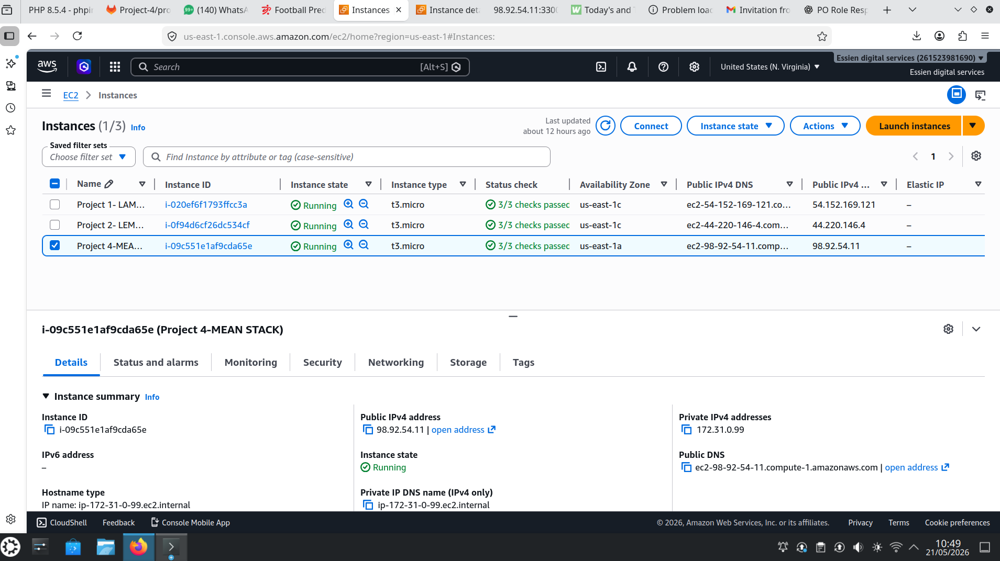

---

# Phase 2: Reviewing EC2 Network Information

After the instance was running, I reviewed its networking information, especially the public IP address required for SSH connectivity and later browser testing.

This reinforced my understanding of the difference between private infrastructure communication and public application access.

### Project Evidence

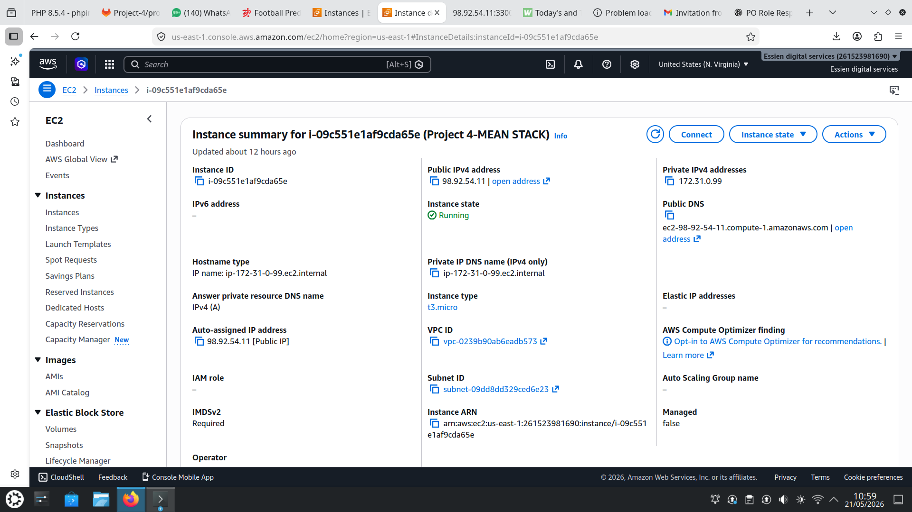

---

# Phase 3: Connecting to Ubuntu Through SSH

I connected remotely to the Ubuntu EC2 instance using SSH.

Example:

```bash
ssh -i <KEY-FILE>.pem ubuntu@<EC2-PUBLIC-IP>
```

This gave me terminal access to the Linux environment where I would install and configure the MEAN Stack application.

### What I Learned

This stage strengthened my understanding of:

- Remote Linux administration
- SSH authentication
- AWS key pairs
- EC2 public addressing
- Secure server access

### Project Evidence

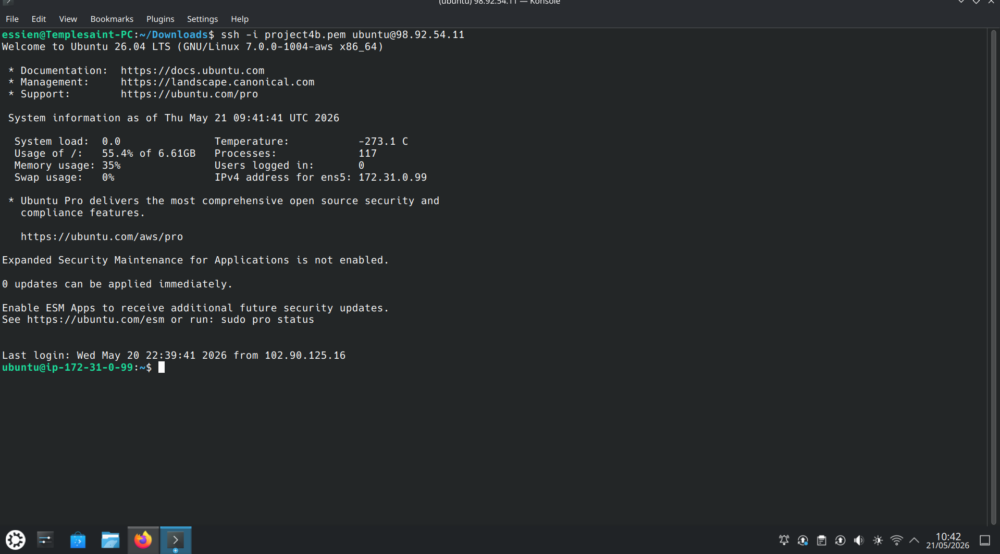

---

# Phase 4: Installing Node.js

The MEAN Stack application requires Node.js as its server-side JavaScript runtime.

I installed Node.js on the Ubuntu EC2 instance and verified the installation.

Example:

```bash
node --version
```

### Why This Matters

Node.js provides the runtime required to execute the application's backend JavaScript.

Without Node.js, the Express application and server process cannot run.

### Project Evidence

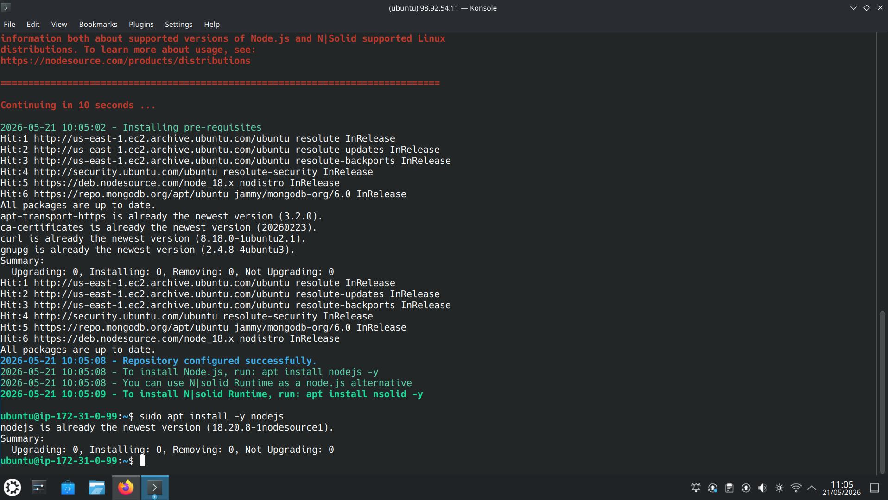

---

# Phase 5: Configuring MongoDB

MongoDB provides the database layer of the MEAN Stack.

After installing and configuring MongoDB, I verified that the database service was running successfully.

### What I Learned

This stage helped me understand that successful application deployment depends on more than application code.

The backend may be configured correctly, but if the database is unavailable, the application can still fail.

```text
Node.js Application
        |
        v
     MongoDB
        |
        v
       Data
```

### Project Evidence

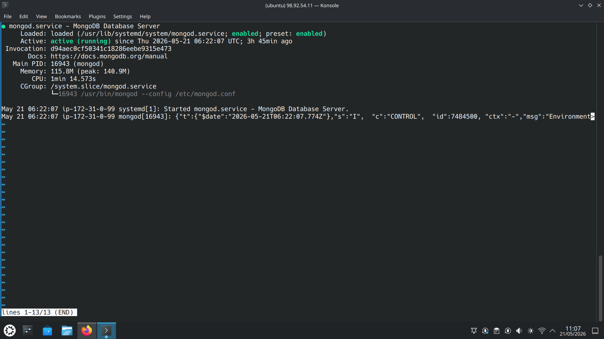

---

# Phase 6: Installing and Verifying npm

npm was used to manage the Node.js application dependencies.

I installed and verified npm before working with the project packages.

Example:

```bash
npm --version
```

Application dependencies can then be installed using:

```bash
npm install
```

### What I Learned

This helped me understand dependency management in application deployment.

The application source code alone is often not enough. It also depends on external libraries and packages declared by the project.

### Project Evidence

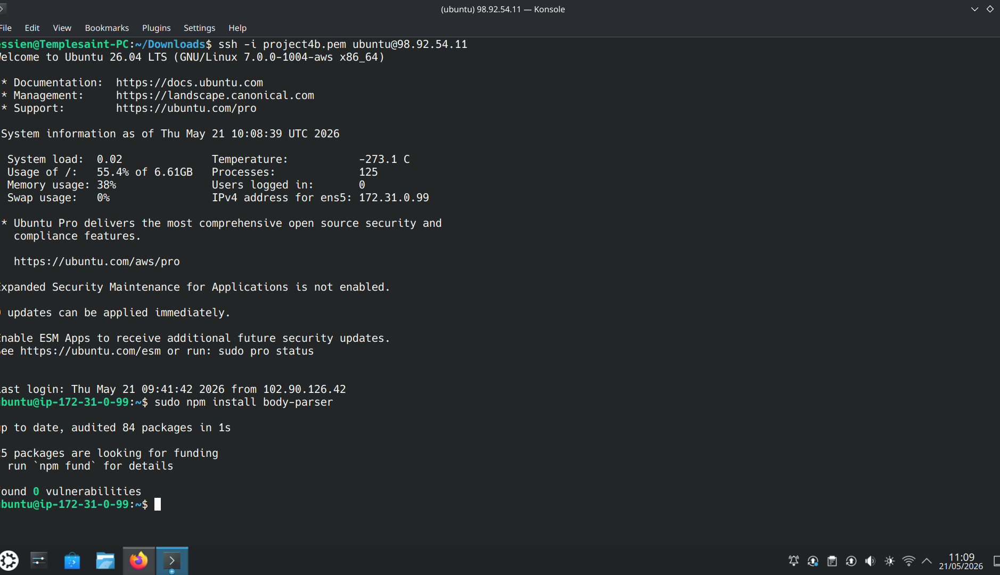

---

# Phase 7: Working With `server.js`

I reviewed and configured the application's `server.js` file.

This file is responsible for starting the Node.js application and exposing the application service on the required port.

This stage helped me connect what I had learned about Node.js with the actual server process responsible for receiving application requests.

### Project Evidence

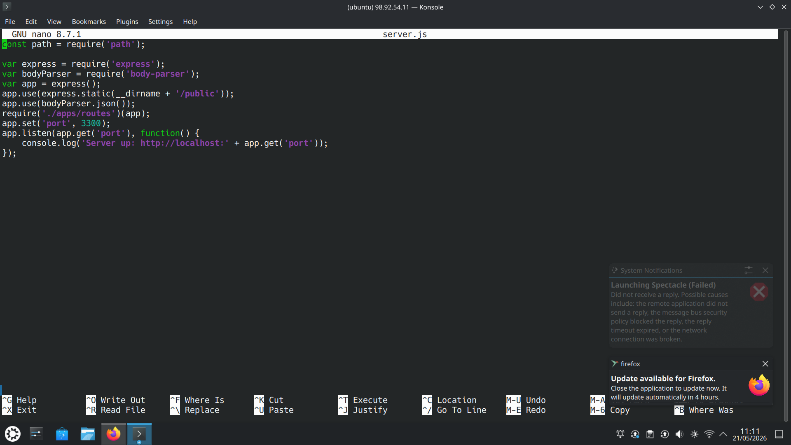

---

# Phase 8: Configuring the MEAN Stack Application

At this stage, I continued preparing the MEAN Stack application for execution.

I reviewed the project files, application structure and backend configuration to ensure the application was correctly prepared to run on the Ubuntu EC2 server.

### What I Learned

This helped me understand that deploying an application involves more than installing software.

The runtime, dependencies, source files, routes, database connections and server configuration must all work together.

### Project Evidence

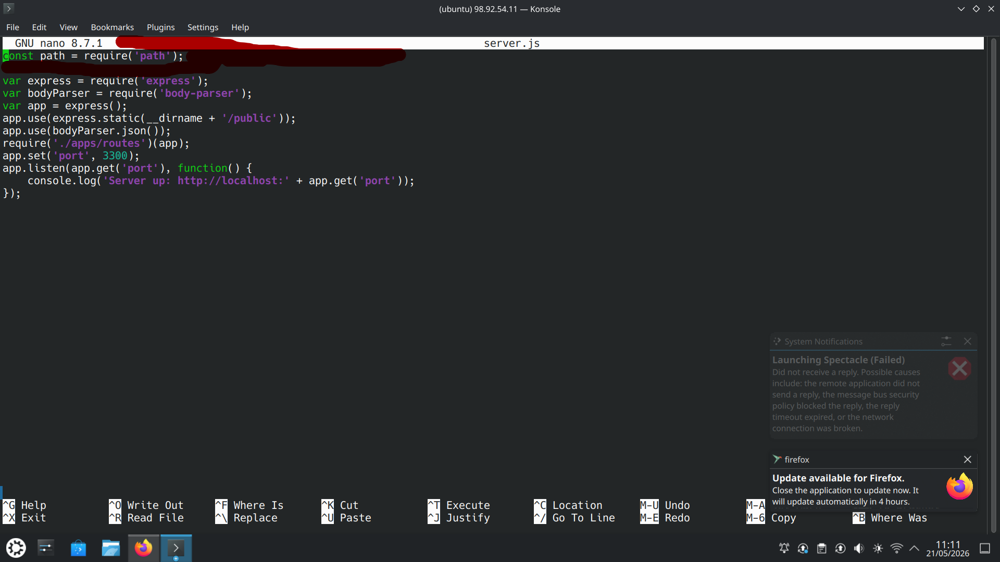

---

# Phase 9: Troubleshooting the Application

The application did not work perfectly on the first attempt.

Instead of assuming the EC2 instance, MongoDB or Linux server was responsible, I began checking the application layer.

This was an important step in developing a structured troubleshooting mindset.

I started thinking about the problem layer by layer:

```text
AWS
 ↓
Linux
 ↓
Node.js
 ↓
npm Dependencies
 ↓
Express Routes
 ↓
Application
```

### Project Evidence

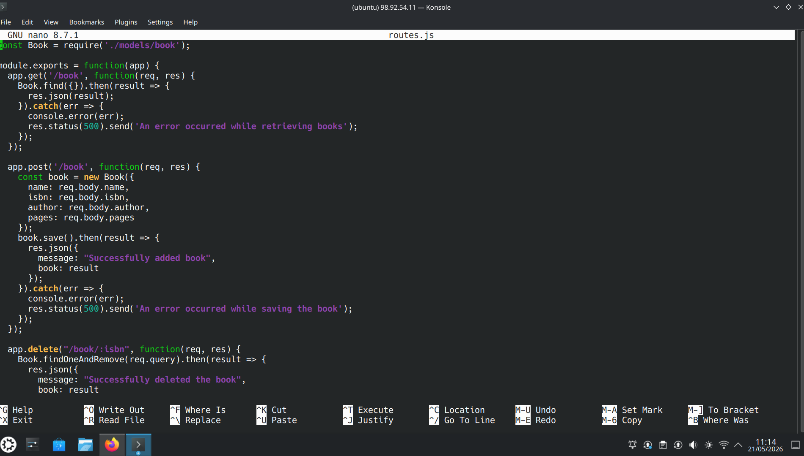

---

# Phase 10: Fixing the `routes.js` Syntax

The application issue was traced to the routing configuration.

I corrected the syntax in the `routes.js` file so that the Node.js application could run correctly.

This became one of the most valuable learning moments in the project because it taught me not to treat every deployment failure as an infrastructure failure.

### Problem

The application server could not run correctly because the route configuration contained an issue.

### Resolution

I inspected the routing file, corrected the syntax and tested the application again.

### What I Learned

A deployment problem can exist at several different layers:

```text
Infrastructure
      ↓
Operating System
      ↓
Runtime
      ↓
Dependencies
      ↓
Application Configuration
      ↓
Network Access
```

Finding the actual failing layer makes troubleshooting much faster.

### Project Evidence

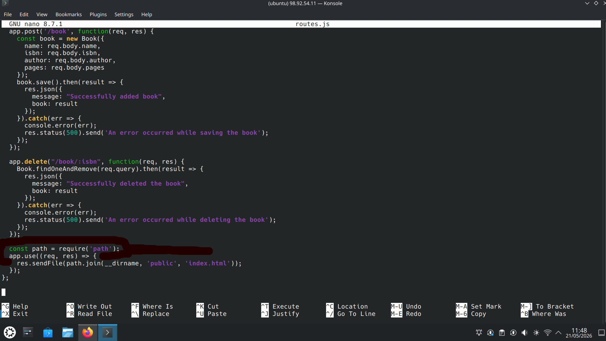

---

# Phase 11: Running the Node.js Server

After correcting the application issue, I successfully started the Node.js server.

The application was configured to listen on:

```text
Port 3300
```

Example:

```bash
node server.js
```

At this point, the application process was running successfully on the EC2 instance.

### Important Lesson

A running application process does not automatically mean users on the internet can reach it.

I still needed to configure the AWS networking layer.

### Project Evidence

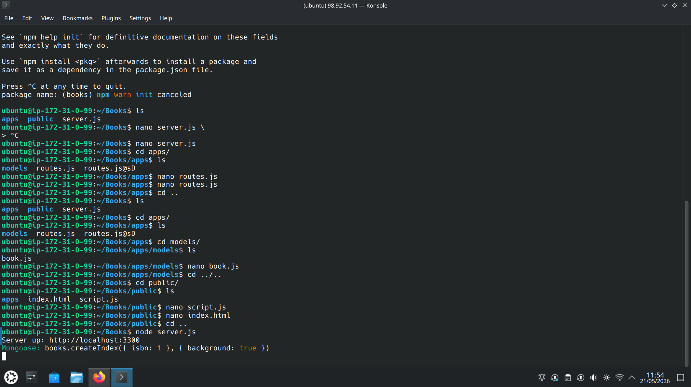

---

# Phase 12: Reviewing AWS Security Group Inbound Rules

With the Node.js application running, I moved to the network-access layer.

I reviewed the EC2 Security Group inbound rules to understand which network connections were currently allowed.

This helped me understand how AWS controls which ports are externally accessible.

### Project Evidence

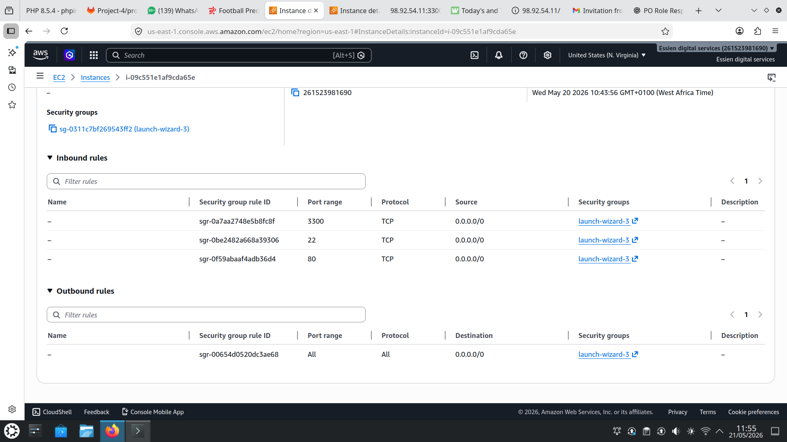

---

# Phase 13: Allowing Application Traffic on Port 3300

The application was listening on port `3300`, so I configured the EC2 Security Group to permit inbound traffic to that port.

```text
Protocol: TCP
Port: 3300
```

This connected the infrastructure and application layers:

```text
Browser
   |
   v
AWS Security Group
   |
TCP 3300
   |
   v
Node.js Application
```

### What I Learned

This stage reinforced one of the most useful lessons from the project:

```text
Application Running
        ≠
Application Reachable
```

A successful deployment requires both the application service and the network configuration to work correctly.

### Project Evidence

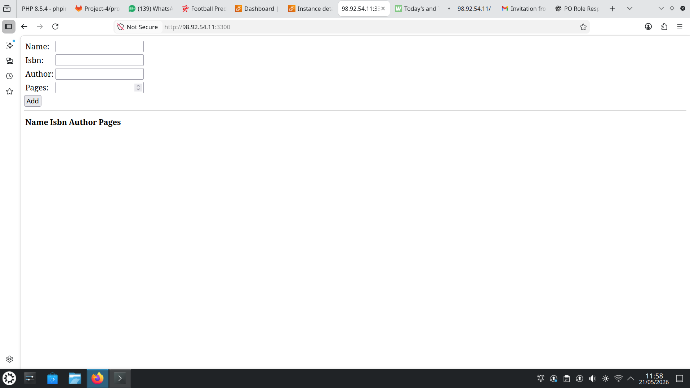

---

# Phase 14: Browser Validation

The final step was testing the Books application through a web browser.

Once the browser successfully displayed the application, I had validated the complete deployment path.

The successful result confirmed that:

```text
AWS EC2             ✅
Ubuntu Linux        ✅
SSH                 ✅
Node.js             ✅
npm                 ✅
MongoDB             ✅
Express.js          ✅
Application Routes  ✅
Port 3300           ✅
Security Group      ✅
Browser Access      ✅
```

### Project Evidence


---

# Troubleshooting Case Study

## Application Routing Failure

One of the most useful learning moments in this project happened when the application did not run correctly.

Instead of rebuilding the entire EC2 server, I worked through the environment layer by layer.

### My Troubleshooting Process

```text
Was EC2 running?
        ↓
       Yes

Could I SSH into Ubuntu?
        ↓
       Yes

Was Node.js installed?
        ↓
       Yes

Was MongoDB running?
        ↓
       Yes

Were dependencies available?
        ↓
       Yes

Was the application configuration correct?
        ↓
       No

Inspect routes.js
        ↓

Correct syntax
        ↓

Restart application
        ↓

Server running successfully
```

The issue was eventually resolved at the application-routing layer.

### What This Taught Me

This experience improved how I approach troubleshooting.

Instead of seeing the entire deployment as one large system, I learned to test each layer independently.

That approach later became very useful in more advanced DevOps projects.

### Troubleshooting Evidence


### Resolution Evidence


---

# What This Project Taught Me

Before this project, I understood several of these technologies separately.

This project helped me understand how they interact as one application deployment.

```text
AWS EC2
   |
Ubuntu Linux
   |
Node.js + npm
   |
Express.js
   |
MongoDB
   |
Angular
   |
Application
   |
AWS Security Groups
   |
End User
```

The biggest lesson was that DevOps work often involves understanding the connections between systems, not simply knowing individual commands.

---

# Skills Demonstrated

## Cloud

- AWS EC2
- Security Groups
- Public IP addressing
- Custom application ports
- Cloud-hosted application deployment

## Linux

- Ubuntu administration
- SSH
- Package installation
- Service verification
- Terminal-based troubleshooting

## MEAN Stack

- MongoDB
- Express.js
- Angular
- Node.js
- npm
- Application routing
- Backend server execution

## Deployment

- Application configuration
- Runtime validation
- Dependency management
- Port exposure
- Browser validation

## Troubleshooting

- Application startup failures
- Route configuration errors
- Network accessibility
- Layer-by-layer diagnosis
- Separating infrastructure issues from application issues

---

# My DevOps Learning Progression

This project represents an important stage in my DevOps learning journey.

In this project, I manually configured and deployed a MEAN Stack application on a single AWS EC2 instance.

That gave me a foundation in:

```text
Linux
Cloud Infrastructure
Application Deployment
Databases
Networking
Troubleshooting
```

As I progressed through later projects, I began reducing manual configuration through automation and configuration-management tools.

My learning progression began moving from:

```text
Manual Deployment
      ↓
Linux Administration
      ↓
Application Troubleshooting
      ↓
AWS Networking
      ↓
Multi-Server Infrastructure
      ↓
Configuration Management
      ↓
Infrastructure Automation
```

For example:

```text
Project 4
Manual MEAN Stack Deployment
        |
        v
Understanding Linux + AWS + Application Layers
```
---

# Security Considerations

Private AWS credentials and SSH private keys should never be committed to GitHub.

The public repository should exclude:

```text
*.pem
*.key
.env
id_rsa
id_ed25519
credentials
secrets
```
---

# Running the Application

A typical deployment workflow for the application includes:

```bash
npm install
```

Then starting the application:

```bash
node server.js
```

The application listens on:

```text
Port 3300
```

After the AWS Security Group allows the application port, the application can be accessed through:

```text
http://98.92.54.11:3300
```

---

# Final Outcome

I successfully deployed and exposed a MEAN Stack Books application from an Ubuntu AWS EC2 instance.

The project gave me hands-on experience connecting:

```text
Cloud Infrastructure
        +
Linux Administration
        +
Application Runtime
        +
Database Services
        +
Application Configuration
        +
Network Access
```

into a working deployment.

Most importantly, it improved how I troubleshoot.

Instead of seeing an application failure as one large problem, I learned to break it into layers and validate each layer independently.

---

# Project Status

## ✅ Completed

**DevOps Project 4: MEAN Stack Application Deployment on AWS EC2**

The completed project demonstrates my growing understanding of cloud infrastructure, Linux administration, full-stack application deployment, AWS networking and structured troubleshooting.

It also became one of the foundations for my later work with configuration management, infrastructure automation and multi-server DevOps environments.